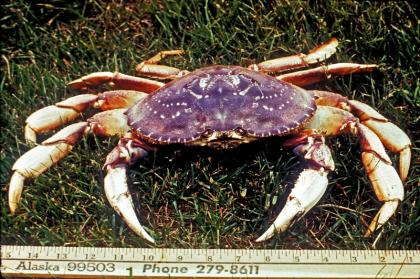
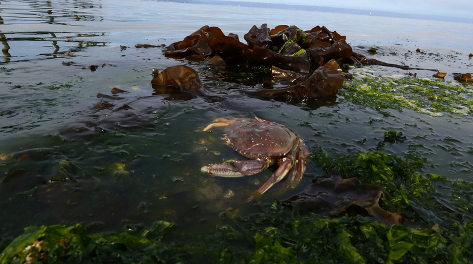

```{r setup, include=FALSE}
library(dplyr)
library(tidyverse)
```

## Data

Catch data in lbs. was collated for marine areas 10, 11, and 13 from Washington Department of Fish and Wildlife catch records. Combined, areas 10, 11, and 13 represent the Sound. Areas 11 and 13 represent the South Sound.

*Note concerning raw data*
In all raw data, ending numerals in variable name represent marine area.

## Marine areas 11 & 13 catch data

```{r catch one, cache=TRUE}
DC_catch.10 <- read.csv("../Data/2007.2017_DC_catch.10.csv", header = TRUE)
```

```{r table 10, echo=FALSE, cache=TRUE}
knitr::kable(DC_catch.10)
```

## Marina area 10 catch data
```{r catch two, cache=TRUE}
DC_catch.11.13 <- read.csv("../Data/2007.2017_DC_catch.csv", header = TRUE)
```

```{r table 11.13, echo=FALSE, cache=TRUE}
knitr::kable(DC_catch.11.13)
```

## Stitching tables
```{r stitch, cache=TRUE}
DC_catch <- inner_join(DC_catch.10, DC_catch.11.13, by = "year")
```

There is now a single table describing the catch rates in lbs. at marine areas 10, 11, and 13.

```{r, cache=TRUE}
head(DC_catch)
```

## Plot of main data

Shows the growth and decline of the *C. magister* fishery in marine areas 10, 11, and 13 through pounds caught between 2007 and 2017.

```{r main plot, echo=FALSE, warning=FALSE, message=FALSE}
ggplot(DC_catch) +
  geom_point(mapping = aes(x = year, y = lbs_dungeness.11), col = "blue", 
             shape  = "triangle") +
  geom_smooth(mapping = aes(x = year, y = lbs_dungeness.11), col = "blue") +
  geom_point(mapping = aes(x = year, y = lbs_dungeness.13), col = "red") +
  geom_smooth(mapping = aes(x = year, y = lbs_dungeness.13), col = "red") +
  ylim(0,125000) +
  labs(title = "Pounds of Dungeness Caught per Year", x = "Year", 
       y = "Pounds of Dungeness")
```

## Analysis

Looking for trends within the main plot.

**Data subsets for analysis**
```{r subsets, cache=TRUE}
lin_data.10 <- subset(DC_catch, year %in% c("2013", "2014", "2015", "2016", "2017"))
lin_data.11 <- subset(DC_catch, year %in% c("2014", "2015", "2016", "2017"))
lin_data.13 <- subset(DC_catch, year %in% c("2011", "2012", "2013", "2014", 
                                            "2015", "2016", "2017"))
```

Subsets focus in on a particular part of the data showing a decline.

## Linear models using subsets



## Liner model - Area 10
```{r linear model 10, cache=TRUE, echo=FALSE}
lm_fit.10 <- lm(year ~ lbs_dungeness.10, data=lin_data.10)
```
```{r linear model 10 summary, cache=TRUE}
summary(lm_fit.10)
```

## Linear model - Area 11
```{r linear model 11, cache=TRUE, echo=FALSE}
lm_fit.11 <- lm(year ~ lbs_dungeness.11, data=lin_data.11)
```
```{r linear model 11 summary, cache=TRUE}
summary(lm_fit.11)
```

## Linear model - Area 13
```{r linear model 13, cache=TRUE, echo=FALSE}
lm_fit.13 <- lm(year ~ lbs_dungeness.13, data=lin_data.13)
```
```{r linear model 13 summary, cache=TRUE}
summary(lm_fit.13)
```

**Analysis findings**
There is no significant decrease in catch rate in marine area 10, however there is a significant decrease in areas 11 and 13.

## Subset plots

Shows a significant decrease in *C. magister* catch from 2014 to 2017.



## Marine area 11

Shows a significant decrease in *C. magister* catch from 2014 to 2017.

```{r subset plot area 11, echo=FALSE, warning=FALSE, message=FALSE}
predicted.11 <- data.frame(catch_pred = predict(lm_fit.11, lin_data.11), 
                           lbs_dungeness.11=lin_data.11$lbs_dungeness.11)

ggplot(lin_data.11) +
  geom_point(mapping = aes( x = year, y = lbs_dungeness.11), 
             col = "blue", shape = "triangle", size = 3) +
  geom_line(data = predicted.11, aes(x=catch_pred, y=lbs_dungeness.11)) +
  labs(title = "Pounds of Dungeness Caught per Year", x = "Year", 
       y = "Pounds of Dungeness")
```

## Marine area 13

Shows a significant decrease in *C. magister* catch from 2011 to 2017.

```{r subset plot area 13, echo=FALSE,  warning=FALSE, message=FALSE}
predicted.13 <- data.frame(catch_pred = predict(lm_fit.13, lin_data.13), 
                           lbs_dungeness.13=lin_data.13$lbs_dungeness.13)

ggplot(lin_data.13) +
  geom_point(mapping = aes( x = year, y = lbs_dungeness.13), 
             col = "red", size = 3) +
  geom_line(data = predicted.13, aes(x=catch_pred, y=lbs_dungeness.13)) +
  labs(title = "Pounds of Dungeness Caught per Year", x = "Year", 
       y = "Pounds of Dungeness")
```

